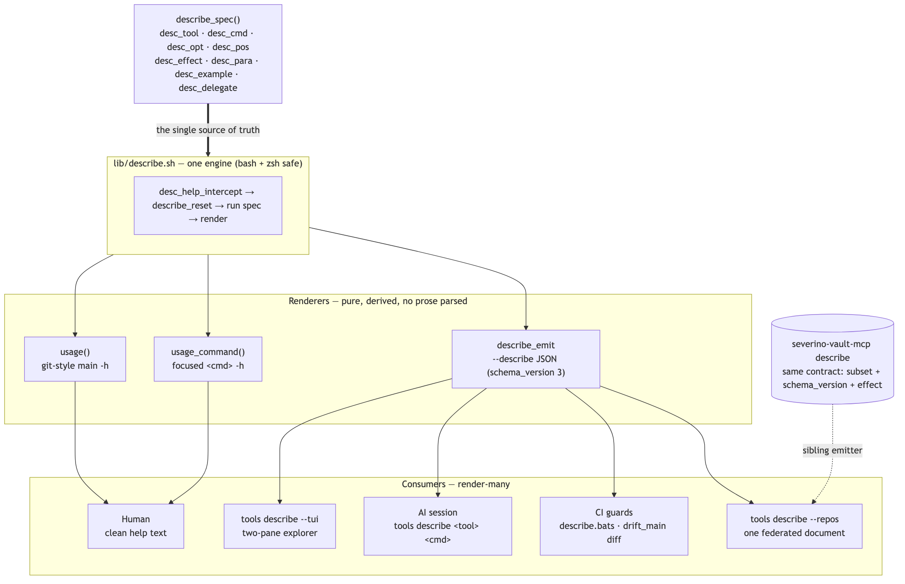

# Architecture

The personal CLI toolchain: small bash/zsh/node tools that share one look and
feel, one help/JSON contract, and one set of drift guards. This doc is the map;
[`command-surface-contract.md`](command-surface-contract.md) is the deep dive on
the contract that ties them together. House rules for editing live in
[`../AGENTS.md`](../AGENTS.md).

## Layout

| Dir | What |
|---|---|
| `bin/` | Exactly one executable per tool, nothing else. `tools install`, the completions, `tools doctor`, and CI discover tools by globbing `bin/*`. |
| `lib/` | Shared helpers flat (`common.sh`, `init.sh`, `key.sh`, `describe.sh`, `drift.sh`, `doctor.sh`, `tui.mjs`); tool-specific support under `lib/<tool>/`. |
| `config/` | Per-tool defaults from layout env vars. `*.example` are templates; their gitignored copies are user-specific. |
| `tests/` | Hermetic bats suite — throwaway keys, tmpdirs, no Keychain. |
| `bench/` | Every measured README claim has a script here; they run in CI. |
| `docs/` | This map, the contract deep-dive, and `docs/diagrams/` (mermaid sources + rendered PNGs). |

## The emit-once command surface

Every tool declares its command surface **once**, in a `describe_spec()` function
(the `desc_*` DSL in `lib/describe.sh`). From that single declaration, one engine
renders every view — the human `-h` screens, the `--describe` JSON contract, the
`--tui` explorer, and the federated `tools describe` document. No tool
hand-writes help; no prose is parsed, so the human help and the machine JSON
cannot drift.

This is the spine of the repo. A new tool becomes self-helping and
self-describing the moment it defines `describe_spec` and puts
`desc_help_intercept "$@"` above its dispatch `case`. The `case` after it is the
only thing not derivable from the spec — pure command→action wiring — and
`describe.bats` guards that the two sets can't drift.

The v3 contract adds an **effect** to every command — a blast-radius class an
agent risk-gates on before running. See
[`command-surface-contract.md`](command-surface-contract.md).

## Drift-guard family

`ts-acl`, `cf-dns`, `adguard`, and `nginx` are one tool wearing four hats:
`lib/drift.sh` is the shared core (`drift_main`), and each guard supplies only
`get_token` / `fetch_live` / `normalize` + config. They expose the same
`show` / `diff` / `pull` surface (declared once in `drift_describe_commands`, so
all four inherit it — including their effects). A `pull` writes the live state
back into a section-scoped mirror block in the Obsidian vault through the MCP's
`update-mirror-block` (one atomic write that also stamps `last_reviewed`), with a
scoped awk rewrite as the offline fallback.

## The MCP boundary

We own `severino-vault-mcp` but call it as a plain, schema-validated CLI — never
hand-editing vault frontmatter or shelling out to `yq`. In `bin/site` every call
goes through the `svmc()` wrapper (which sets `SVMC_VAULT_PATH`); elsewhere it is
`SVMC_VAULT_PATH="$NOTES_HOME" severino-vault-mcp …`. The MCP is the one
canonical writer and the one canonical frontmatter schema (`hq schema`
regenerates HQ's copy from it). It emits the **same `describe` contract** this
repo defines (a subset + the shared `schema_version` and `effect`), so
`tools describe --repos` folds it into one federated document.

## Verification

`tools check` runs everything CI runs: shebang-driven `bash -n` / `zsh -n` /
`node --check`, shellcheck, the bats suite, and the bench assertions
(`--no-bench` skips the slow step). `tools doctor --all` is the cross-system
rollup (hq doctor, hq schema --check, site doctor); `--live` adds the drift
guards (network + age key). `tools status --json` / `tools doctor --json` give
machine-readable state.
