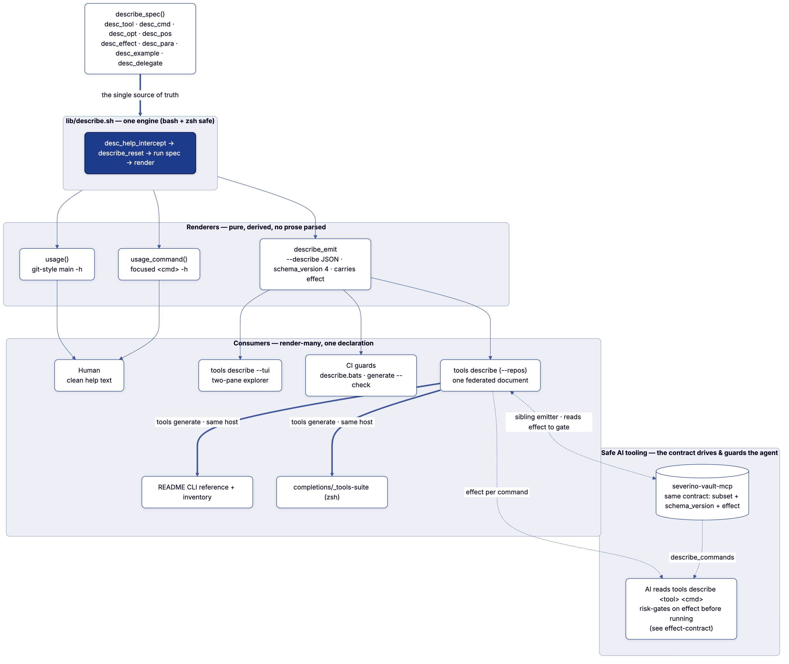

# Architecture

The personal CLI toolchain: small bash/zsh tools with TypeScript modules under
`lib/`, sharing one look and feel and one help/JSON contract. It owns nothing
another system owns: infrastructure is HQ's, publishing is the site repo's, and
vault writes are the MCP's. This doc is the map;
[`command-surface-contract.md`](command-surface-contract.md) is the deep dive on
the contract that ties them together. House rules for editing live in
[`../AGENTS.md`](../AGENTS.md).

## Layout

| Dir | What |
|---|---|
| `bin/` | Exactly one executable per tool, nothing else. `tools install`, `tools describe`, `tools doctor`, and CI discover tools by globbing `bin/*`. |
| `lib/` | Stable narrow SDK modules under `lib/sdk/`; `common.sh` as the compatibility aggregator; shared engines (`describe.sh`, `tui.ts`); tool-specific support under `lib/<tool>/`. |
| `config/` | Per-tool defaults from layout env vars. `*.example` are templates; their gitignored copies are user-specific. |
| `schemas/` | Machine-enforced cross-tool contracts. Runtime verification inputs, not prose documentation. |
| `tests/` | Hermetic bats suite: tmpdirs and stubbed binaries, never the network. CI runs it. |
| `bench/` | Every measured README claim has a script here; `tools check` runs them. |
| `docs/` | This map, the contract deep-dive, and `docs/diagrams/` (mermaid sources + rendered PNGs). |

## The emit-once command surface

Every tool declares its command surface **once**, in a `describe_spec()` function
(the `desc_*` DSL in `lib/describe.sh`). From that single declaration, one engine
renders every view — the human `-h` screens, the `--describe` JSON contract, the
`--tui` explorer, and the federated `tools describe` document. No tool
hand-writes help; no prose is parsed, so the human help and the machine JSON
cannot drift.

This is the spine of the repo. A new tool becomes self-helping and
self-describing the moment it defines `describe_spec` and puts
`desc_help_intercept "$@"` above its dispatch `case`. The `case` after it is the
only thing not derivable from the spec — pure command→action wiring — and
`describe.bats` guards that the two sets can't drift.

**The docs are derived too — by the same host.** The README CLI
reference/inventory and the zsh completion file are not hand-written: `tools
generate` is another render-many consumer that regenerates both from the same
federated JSON. The same emitter that answers `-h` writes the documentation, so
the prose a human reads, the completions a shell offers, and the JSON an agent
parses are three views of one declaration and cannot drift. `tools check`
validates every emitter against `schemas/cordon-v4.json` (vendored from the
[Cordon](https://github.com/joeseverino/cordon) spec) and fails when
either generated artifact is stale. Generation fails closed if any tool did not
emit a valid contract; it never silently drops a broken tool from the generated
surfaces.

The v4 contract also carries required, globally ordered inventory metadata.
README, completions, and the TUI consume that one order; schema validation
rejects missing metadata and duplicate positions. Every command also carries an
**effect** — a blast-radius class an agent risk-gates on before running. See
[`command-surface-contract.md`](command-surface-contract.md).

## The reusable SDK substrate

Tools' shared mechanics are a small SDK for this repo, sibling repos, one-off
scripts, and agent utilities. Shell consumers import `lib/sdk/core.sh`,
`lib/sdk/svmc.sh`, or `lib/sdk.sh`; Node consumers import `lib/sdk/process.ts`,
`result.ts`, and `svmc.ts`. Existing commands keep sourcing `common.sh`, which
is now only a compatibility aggregator over those narrow modules.

Structured utilities use the versioned `result-v1` envelope. Fleet capabilities
(describe/brief emitters, engine consumers, schema and install surfaces) live in
`config/capabilities.json` and are derived by `capabilities.ts`; on-disk fleet
state remains owned by `repos --json`. The registry also declares how each
repository installs and how it reports its fingerprint, which drives `tools
reinstall` and the installed-matches-source check in `tools doctor`. The
toolchain holds no credentials (see [`../SECURITY.md`](../SECURITY.md)). See
[`SDK.md`](SDK.md).

Cross-repository SSOT relationships live in `config/contracts.json`. The graph
records contract owners and executable projection checks while repository
discovery stays in `repos --json` and path resolution stays in the capability
registry. `tools contracts --check` is the generic drift face: domain owners
perform comparisons; Tools composes their results. Its `local → fleet → live`
scope ladder keeps CI hermetic while allowing doctor to widen the same graph
deliberately.

## Safe AI tooling — the contract drives *and* guards the agent

The same JSON that feeds the README and completions is what makes this toolchain
safe for an AI to operate. An agent doesn't guess what a tool does or read its
handler — it fetches the scope it is about to act on (`tools describe <tool>
<command>`, or the MCP's `describe_commands` tool) and gets back the command's
flags, args, examples, **and its `effect`**. The effect is the one fact an agent
cannot infer from the flags: a blast-radius class (`read` → `local_write` →
`vault_write` → `remote_write` → `deploy`) plus `+network` / `+interactive` tags.
That single signal lets the agent risk-gate before it runs anything — a `read`
runs freely; a `deploy` or a `remote_write` gets a confirmation or a dry-run
first. `severino-vault-mcp` is on both ends of this loop: it is a *sibling
emitter* folded into the federated document, **and** the channel through which an
AI session reads the contract and inherits the safeguards. The contract is what
turns "an agent with shell access" into "an agent that knows the blast radius of
every command before it pulls the trigger." See
[`command-surface-contract.md`](command-surface-contract.md) for the effect
model and the scoped-lookup AI path.

## HQ, not a second copy

Infrastructure facts (DNS records and rewrites, proxy hosts, the tailnet
policy, certificates, containers) belong to Severino HQ, which reads them from
each provider and reconciles what it declares. The toolchain reaches HQ through
`lib/hq-call`, HQ's own MCP tool contract carried over SSH with the operator's
certificate: `hq call <tool> [json]` exposes every capability, and `hq drift`
reads HQ's reconciliation verdict (what has moved past its last applied
declaration, or gone unhealthy). `tools doctor --live` gates on it. Nothing here
fetches a provider or keeps a cache of one.

## The MCP boundary

We own `severino-vault-mcp` but call it as a plain, schema-validated CLI — never
hand-editing vault frontmatter or shelling out to `yq`. Shell and Node callers
go through `lib/sdk/svmc.sh` and `lib/sdk/svmc.ts`, respectively; both set the
vault path and binary override consistently. The MCP is the one
canonical writer and the one canonical frontmatter schema (`hq schema`
regenerates HQ's copy from it). It emits the **same `describe` contract** this
repo defines (a subset + the shared `schema_version` and `effect`), so
`tools describe --repos` folds it into one federated document.

## Verification

`tools check` runs everything CI runs (`bash -n` / `zsh -n`, the strict
TypeScript type-check, shellcheck, contract validation, the bats suite) plus the
bench assertions (`--no-bench` skips them). `tools doctor --all` is the
cross-system rollup (`hq doctor`); `--live` adds `hq drift`. `tools status
--json` / `tools doctor --json` give machine-readable state.
