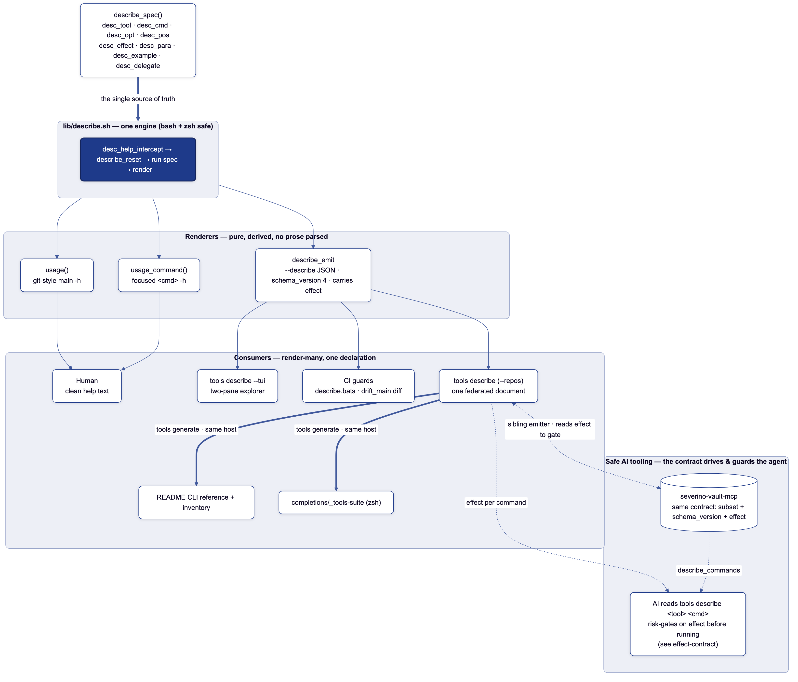
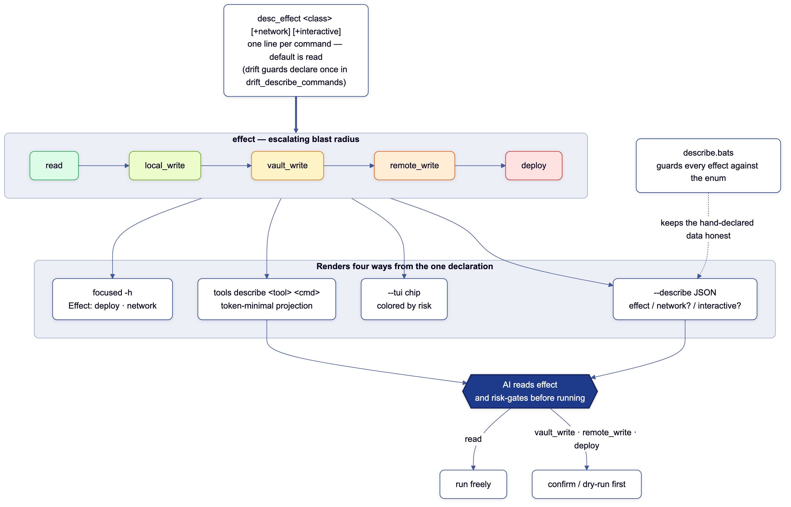

# The command-surface contract

> Emit once, render many. One declaration per tool; every view derived from it.

This repo emits the [**Cordon**](https://github.com/joeseverino/cordon)
command-surface contract — the language-agnostic standard for declaring a CLI's
surface once and carrying each command's **blast radius**. Read Cordon for the
framework itself: the [contract shape and schema](https://github.com/joeseverino/cordon#the-contract),
the [effect ladder](https://github.com/joeseverino/cordon#the-effect-ladder), and
[how to write an emitter](https://github.com/joeseverino/cordon/blob/main/docs/IMPLEMENTERS.md).
**This page is the Bash *implementation* of that framework** — the `desc_*` DSL,
the renderers, the runtime gate, and the federation that fold it into the wider
toolchain.

A tool's surface — its commands, flags, arguments, prose, examples, external
flag-ownership, and effect — is declared exactly once in a `describe_spec()`
function. Two pure renderers turn that into the human help and the machine JSON,
so they can never drift (there is no prose to parse). See
[`ARCHITECTURE.md`](ARCHITECTURE.md) for where this sits in the repo, and
[`../AGENTS.md`](../AGENTS.md) for the editing rules.



## The DSL

```bash
describe_spec() {
    desc_tool "hq" "Sync vault docs into Severino HQ and operate the deploy."
    desc_inventory "Integrations" 130       # aggregate group + workflow order
    desc_synopsis "hq <command>"

    desc_cmd restart -- "docker compose restart app — no rebuild, no migrations"
    desc_effect deploy +network            # ← blast radius

    desc_cmd create  -- "Create or update a Project or Asset in HQ"
    desc_effect remote_write +network
    desc_pos kind "{project,asset}" -- "What to create"
    desc_delegate "HQ's manage.py — run 'hq create <kind> -h' for the live flags"
}
```

| Helper | Declares | Scope |
|---|---|---|
| `desc_tool` / `desc_synopsis` | name, one-liner, usage line | tool |
| `desc_inventory` | aggregate group + globally unique workflow order | tool |
| `desc_cmd` | a subcommand (opens its scope) | — |
| `desc_opt` / `desc_pos` | a flag / a positional (`+repeat`, `+optional`, `+variadic`, `"{a,b,c}"`) | current command |
| `desc_effect` | blast radius + `+network` / `+interactive` | current command |
| `desc_para` / `desc_example` | prose / an example | current command |
| `desc_delegate` | "flags owned by another repo" | current command |
| `desc_env` | an environment variable (human help only) | tool |

Everything after a `desc_cmd` is **scoped to that command** — declare tool-level
prose/examples/effect *before the first `desc_cmd`*. One dispatch line —
`desc_help_intercept "$@"` — renders the whole help + machine surface; the `case`
after it is pure wiring.

A `desc_para` is **one logical paragraph stored as a single unwrapped string** —
never a hard-wrapped source line. Every renderer (`-h`, README, the `--tui`
expand pane) reflows it to its own width, so no presentation line-breaks are
baked into the source of truth; declare one `desc_para` per paragraph (renderers
space them) rather than an empty `desc_para ""` separator. Validation fails
closed on a paragraph that ends mid-sentence or is empty, so the data stays
reflowable as the repo scales.

## Three tiers, cleanly separated

| Tier | Command | For |
|---|---|---|
| `-h` | `<tool> -h`, `<tool> <cmd> -h` | humans — clean wrapped text |
| `--describe` | `<tool> --describe`, `tools describe [<tool> [<cmd>]]` | agents / guards — JSON |
| `--tui` | `tools describe --tui` (alias `tools tui`) | humans — interactive explorer; `e` expands a command's full prose + examples |

The main `-h` stays a scannable git-style command list with a
`Run '<tool> <cmd> -h'` pointer; the focused `<cmd> -h` renders that one
command's options, args, prose, examples, and effect line.

## The JSON contract

The wire format is **Cordon `schema_version 4`** — defined, with its full field
list and `additionalProperties: false` schema, in the
[Cordon repo](https://github.com/joeseverino/cordon#the-contract)
([`cordon-v4.json`](https://github.com/joeseverino/cordon/blob/main/schema/cordon-v4.json)).
This emitter produces the **complete** contract — every optional field included:
per-scope `paras` / `examples` and `delegates`, option `metavar`, `repeatable`,
and positional `variadic`. (The sibling `severino-vault-mcp` emitter targets the
same schema but omits the prose fields argparse can't supply.) Output is
byte-deterministic (no timestamps), so a guard can diff it.

## Effect: the risk signal an agent can't read off the flags

Cordon's [effect ladder](https://github.com/joeseverino/cordon#the-effect-ladder)
— `read → local_write → vault_write → remote_write → deploy`, plus the optional
`network` / `interactive` tags — is the one fact an agent cannot infer from the
flags, and the signal it gates on before running a command (`hq restart`
(`deploy`) vs `vault status` (`read`)). See Cordon for the ladder's definitions
and the `network`-vs-dependency-install distinction; below is how this repo
*declares and enforces* it.



```bash
desc_effect deploy +network          # after a desc_cmd …
desc_effect local_write              # … or after desc_tool, for a leaf tool
```

Every tool and command declares `desc_effect` explicitly, including `read`.
Missing or duplicate declarations fail closed before help, JSON, or the runtime
gate can render. It renders five ways from the one line: a terse `Effect:` line
in the focused `-h` (only when non-trivial), `effect` / `network?` /
`interactive?` in the JSON
(`effect` always emitted; the boolean tags only when true, to stay lean), a
color-coded chip in `--tui`, the field in the scoped lookup below, and — the
load-bearing one — the **runtime gate**.

**The runtime gate (`desc_guard_effect`).** A `deploy` (the top of the ladder —
it ships to prod) requires an explicit confirmation before it runs. The gate is
derived from the same `desc_effect` line, so the warning can't disagree with the
contract, and it lives in the one intercept every tool already calls
(`desc_help_intercept`) — a new deploy command is gated the moment it declares
its effect, with zero per-tool wiring. At a TTY it prompts `[y/N]`;
non-interactive it **fails closed** unless `TOOLS_ASSUME_YES=1` is set (the
bypass CI and intentional automation use), so a stray `hq ship` / `site publish`
can't fire by accident, by hand or by an agent. A tool with no `describe_spec`
has no executable declared surface to gate. Covered by `site-mcp.bats`.

**Declared once where it's shared:** the drift guards declare their effects a
single time in `drift_describe_commands` (show/diff `read +network`, pull
`vault_write +network`), and all four guards inherit them.

## Scoped lookup — the token-minimal AI path

```console
$ tools describe hq restart
{"ok":true,"schema_version":4,"tool":"hq","name":"restart","args":[],
 "effect":"deploy","network":true,"paras":[],"examples":[]}
```

`tools describe <tool> <command>` projects the contract down to a single command
object (lifting in `tool` + `effect`), so an agent fetches just the scope it is
about to act on instead of the whole surface. An unknown command returns
`{"ok":false,"error":"… commands: …"}` with the valid set.

## Federation

`tools describe` federates every `bin/*` emitter into one document; `--repos`
folds in sibling repos that emit the same contract — today
`severino-vault-mcp describe`. `schemas/cordon-v4.json` here is a copy vendored
verbatim from the [Cordon repo](https://github.com/joeseverino/cordon) (the
single source of the contract); `tools check` / `tools doctor` diff it against
the canonical source (`cordon_schema_status`, via `$CORDON_HOME` or the sibling
checkout) so the copy can't silently drift. `tools` is one conformant emitter,
and `tools check` runs `tools describe --repos` through that schema, so a drifted
*sibling emitter* fails *here* (the cross-repo drift guard). One schema, every
emitter checked. (When the sibling isn't installed, `--repos` folds in nothing.)

`tools generate` is another render-many consumer: it derives zsh completions
and the README CLI reference/inventory from the local aggregate. CI validates
every tool *and folded-in sibling* document against `schemas/cordon-v4.json` and
checks those generated files for drift. So the docs ship from the same emitter
that answers `-h` — the prose, the completions, and the JSON cannot disagree.

`severino-vault-mcp` closes the loop on both ends: it is a sibling emitter
folded into the federated document via `--repos`, **and** the channel
(`describe_commands`) through which an AI session reads the contract — including
the `effect` it risk-gates on (above). That is what makes this toolchain safe
for an agent to drive: it learns each command's blast radius from the contract
before it runs anything, instead of guessing from flags or reading handlers.

## How it can't drift

- **spec ↔ dispatch parity** — every declared command has a dispatch arm and
  vice versa (`describe.bats`).
- **effect enum** — every emitted `effect` is a valid class; `network` /
  `interactive` only ever appear as `true` (`describe.bats`).
- **JSON Schema** — every real tool *and folded-in sibling* validates against
  the committed v4 schema (`tools check` runs `describe --repos` through it).
- **inventory order** — every tool has a group and globally unique order;
  duplicate positions fail validation before any surface is rendered.
- **generated consumers** — completions and the README reference/inventory must match
  the current aggregate (`tools generate --check`).
- **round-trip** — every JSON option/command appears in some help view.
- **bash/zsh byte-parity** — `lib/describe.sh` runs identically under both
  (no numeric array indexing, no `read -ra`), so the lone zsh tool (`dns-test`)
  self-describes from the same engine.
- **byte-determinism** — `drift_main` diffs the whole emitted surface.

## Re-rendering the diagrams

The `.mmd` sources in `docs/diagrams/` render to committed PNGs with
`diagram docs/diagrams/` (pre-rendered because GitHub's live Mermaid clips node
text in Safari). The renderer is the Cordon-conformant `diagram` command in this
toolchain.
